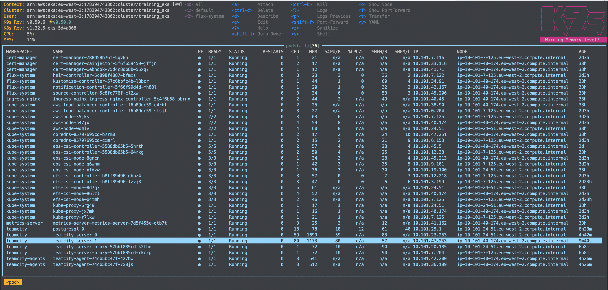

# TeamCity Kubernetes Deployment



## Architecture Overview

This deployment consists of:
- **TeamCity Server**: HA setup with 2 replicas using StatefulSet
- **HAProxy Load Balancer**: Routes traffic between server instances
- **TeamCity Agents**: Horizontally scalable agents in separate namespace
- **Shared Storage**: EFS-based ReadWriteMany storage for HA

## Prerequisites

### Infrastructure Requirements
- Kubernetes cluster (tested on EKS)
- ReadWriteMany storage class (e.g., EFS with CSI driver)
- Ingress controller (nginx recommended)
- cert-manager (optional, for TLS)

## Quick Start

### 1. Create Namespaces
```bash
kubectl create namespace teamcity
kubectl create namespace teamcity-agents
```

### 2. Install PostgreSQL Database
```bash
helm repo add bitnami https://charts.bitnami.com/bitnami
helm repo update

helm install postgresql bitnami/postgresql \
  --namespace teamcity \
  --set auth.username=teamcity \
  --set auth.database=teamcity \
  --set auth.postgresPassword=teamcity-admin \
  --set auth.password=teamcity-pass
```

### 3. Deploy TeamCity Server
```bash
helm install teamcity-server ./teamcity-server \
  --namespace teamcity
```

### 4. Deploy TeamCity Agents
```bash
helm install teamcity-agent ./teamcity-agent \
  --namespace teamcity-agents
```

### 5. Initial Setup
After deployment, initialize TeamCity nodes manually:
```bash
kubectl port-forward -n teamcity svc/teamcity-server-direct-1 8111:8111
```
Open http://localhost:8111 and follow the setup wizard.

## Configuration

### Scaling Agents
```bash
helm upgrade teamcity-agent ./teamcity-agent \
  --namespace teamcity-agents \
  --set replicaCount=5
```

### Custom Storage Classes
Update storage class in values files:
```yaml
persistence:
  storageClass: "your-storage-class"
```

### Access TeamCity UI
```bash
# Port forward to access directly
kubectl port-forward -n teamcity svc/teamcity-server 8111:8111

# Or via ingress (if configured)
# https://teamcity.example.com
```

## High Availability Features

### Server HA
- **StatefulSet**: Ensures predictable pod names and stable storage
- **Pod Anti-Affinity**: Spreads server pods across different nodes
- **Pod Disruption Budget**: Maintains minimum availability during updates

## Known Limitations

1. **Initial Setup**: Manual authorization of server nodes required on first deployment
2. **EFS Dependency**: Requires AWS EFS or equivalent ReadWriteMany storage
3. **Agents Authorization**: Agents should be authorized manually. Because of this, HPA is not configured for agents. 

## License

This project is provided as-is for educational and evaluation purposes.